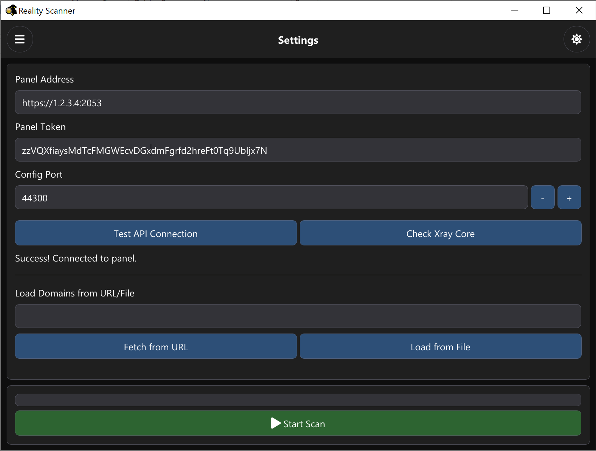
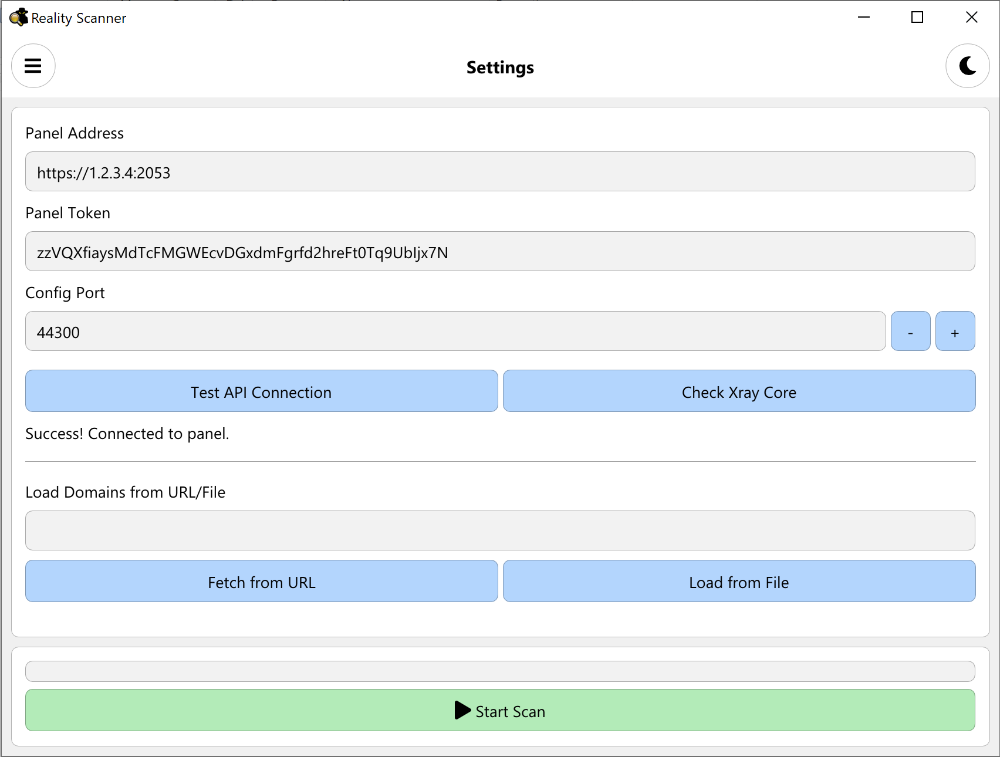

# RealityScanner




RealityScanner is a fast, standalone, and professional Windows application built with C++ and ImGui to help you scan and find the best SNI domains for your **Reality** configurations. It works by connecting directly to your **3x-ui** panel to dynamically generate and test configurations.

## Features
- **Standalone Executable**: Fully compiled natively on Windows, requiring no external dependencies like Python.
- **Auto-downloads Xray Core**: Downloads the correct version of Xray core automatically if missing.
- **Clean UI**: A beautiful interface built using ImGui with Light and Dark mode support.
- **Config Management**: Automatically communicates with your **3x-ui** panel to create, update, and test temporary configs.
- **Auto Cleanup**: Deletes the temporary config and client once scanning is complete to keep your panel clean.
- **Smart Sorting**: Sort domains by response delay, name, or status.
- **Load Domains**: Easily load domains from a text file or fetch them from a URL.

## Usage
Simply run `RealityScanner.exe`.
1. Open the app and enter your **3x-ui** panel URL, Login Token (Cookie), and the Target Port.
2. Ensure you have downloaded the Xray core from the Settings tab.
3. Switch to the Domains List tab to paste or load your SNI domains.
4. Click **Start Scan** and watch the results table to find the lowest ping SNI!

## Build
The project uses CMake. You can use the provided PowerShell script:
```powershell
.\auto_build.ps1
```
It will fetch dependencies, build the project, and create a standalone executable.
